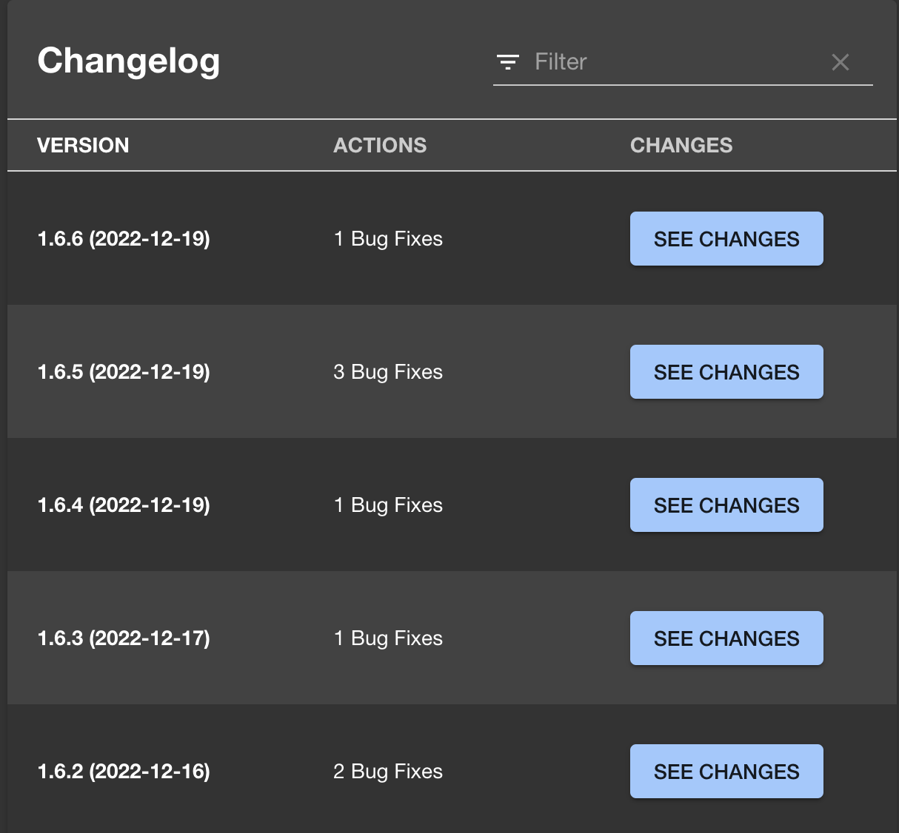

# @rsc-labs/changelog-plugin


Backstage Changelog Plugin is configurable and customizable plugin for viewing a changelog.
You can write your own parser, use [SemVer](https://semver.org/) parser or use default one, which follows [Keep the changelog](https://keepachangelog.com/) notation.

### What is Changelog, why and who needs it?
Description from [Keep the changelog](https://keepachangelog.com/).

A changelog is a file which contains a curated, chronologically ordered list of notable changes for each version of a project.
It is being created to make it easier for users and contributors to see precisely what notable changes have been made between each release (or version) of the project.
People need changelog. Whether consumers or developers, the end users of software are human beings who care about what's in the software. When the software changes, people want to know why and how.

# Getting started

If you haven't already, check out the [Backstage docs](https://backstage.io/docs/getting-started/) and create a Backstage application with
```
npx @backstage/create-app
```

Then, you will need to install and configure the changelog plugins for the frontend and the backend.

## Frontend plugin

Install:
```bash
cd packages/app
yarn add @rsc-labs/backstage-changelog-plugin
```

You have two options how you can use Changelog functionality.

### Card in Overview page:

Add the card to `packages/app/src/components/catalog/EntityPage.tsx`:
```jsx
// import:
import { EntityChangelogCard } from '@rsc-labs/backstage-changelog-plugin';

// use it in entity view
const overviewContent = (
  <Grid container
  ...
    <Grid item md={6} xs={12}>
      <EntityChangelogCard />
    </Grid>
  </Grid>
)
```


### Table in separated tab

Add content to `packages/app/src/components/catalog/EntityPage.tsx`:
```jsx
// import:
import { EntityChangelogContent } from '@rsc-labs/backstage-changelog-plugin';

const serviceEntityPage = (
  <EntityLayout
  ...
    <EntityLayout.Route path="/changelog" title="Changelog">
      <EntityChangelogContent/>
    </EntityLayout.Route>
  </Grid>
)
```


### Check if annotations are ok

You can also check before if annotations are configured properly and depends on the result add EntityChangelogContent or EntityChangelogCard.
Two methods are exported:
```jsx
export const isChangelogAnnotationConfigurationOk = (entity: Entity) : boolean
```
It checks if configuration of annotations is ok.
```jsx
export const getInfoAboutChangelogAnnotationConfiguration = (entity: Entity)
```
It return information what is wrong with configuration of annotations.

### Frontend configuration

We have created parser, which shall be able to parse English version of [Keep the changelog](https://keepachangelog.com/). We have a [SemVer](https://semver.org/) parser also available.
If you have different notation in your organization, you can define your own parser and pass it to the plugin.

For details see: [How to create own parser?](/plugins/backstage-changelog-plugin/README.md#how-to-create-my-own-parser)


### Changing parser to a SemVer
 
 
```jsx
import { semverParser } from '@rsc-labs/backstage-changelog-plugin';
...
<Grid item md={6} xs={12}>
    <EntityChangelogCard parser={semverParser} />
</Grid>
```




## Backend plugin

Install:
```bash
cd packages/backend
yarn add @rsc-labs/backstage-changelog-plugin-backend
```

Create a file `packages/backend/src/plugins/changelog.ts`:
```typescript
import {
    createRouter,
  } from '@rsc-labs/backstage-changelog-plugin-backend'
  import { Router } from 'express';
  import { PluginEnvironment } from '../types';
  
  export default async function createPlugin(
    env: PluginEnvironment,
  ): Promise<Router> {
    return await createRouter({
      discovery: env.discovery,
      tokenManager: env.tokenManager,
      logger: env.logger,
      reader: env.reader
    });
  }
```

Add the plugin to `packages/backend/src/index.ts`:
```typescript
// import:
import changelog from './plugins/changelog';
...

async function main() {
  ...
  // add env
  const changelogEnv = useHotMemoize(module, () => createEnv('changelog'));
  ...
  // add to router
  apiRouter.use('/changelog', await changelog(changelogEnv));
  ...
}
```

Backend plugin supports 3 fields, which can be used for reading a Changelog.
Changelog itself is related to entity, so configuration is done by Annotations.
```yaml
apiVersion: backstage.io/v1alpha1
kind: Component
metadata:
  name: example-website
  annotations:
    backstage.io/source-location: "file:/home/backstage/backstage-changelog/examples/"
    changelog-file-ref: "url:https://github.com/RSC-Labs/backstage-changelog-plugin/tree/main/CHANGELOG.md"
    changelog-name: "CHANGELOG_CUSTOM_NAME.md"

```
Plugin uses following logic:
1) If "changelog-file-ref" is provided it takes precedence over other options, so it is used for reading a Changelog
2) If not provided, then plugin check is "changelog-name" is provided. If yes, then it uses "backstage.io/source-location" as a location path together with "changelog-name"
3) If no above options are provided, plugin uses "backstage.io/source-location" for reading a file named "CHANGELOG.md".

Both "file" and "url" options are supported.

## TODO

[ ] Unit tests

[ ] Move logic from frontend to backend

## Contribution

Contributions are welcome and they are greatly appreciated!

## License

Licensed under the Mozilla Public License, Version 2.0: https://www.mozilla.org/en-US/MPL/2.0/

---

© 2023 RSC https://rsoftcon.com/